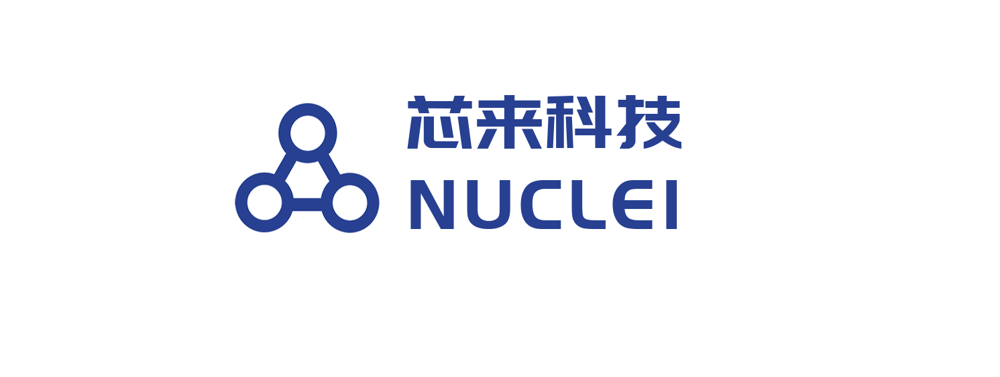
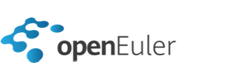

Penglai-Enclave is a scalable enclave system for RISC-V architecture.

You can find more details in our online document: [Penglai-doc](https://penglai-doc.readthedocs.io/en/latest/)

## Quick Start

Penglai uses Docker for building and uses submodules to track different components.

Therefore, the only requirement to build and run penglai-demo is:

- [Docker](https://docs.docker.com): for building/running Penglai
- Git: for downloading the code

The version for FPGA and RISC-V board is coming soon.

### Building

First, download the all the code:

`git clone https://github.com/Penglai-Enclave/Penglai-Enclave-TVM.git`

Enter the penglai-enclave directory, `cd penglai-enclave

And then,

`git submodule update --init --recursive`

Last, build penglai using our Docker image:

`./docker_cmd.sh build`

When the building process finished, you are ready to run the penglai demo.

## Running

In the penglai-enclave directory,

`./docker_cmd.sh qemu`

If everything is fine, you will enter a Linux terminal booted by Qemu with Penglai-installed.

Enter the terminal with the user name: root, and passwords: penglai.

**Insmod the enclave-driver**

`sh install.sh`

And the, you can run a demo, e.g., a hello-world enclave, using

`./host  hello-world`

Here, the  `host` is an enclave invoker, which will start an enclave (name from input).

## License Details

Mulan Permissive Software License，Version 1 (Mulan PSL v1)

## Code Structures

- penglai-buildroot: The buildroot rootfs for Penglai
- penglai-linux-5.10.2: The Untrusted OS kernel (kernel 5.10.2) for Penglai
- penglai-opensbi: The secure monitor of Penglai, implementing isolation using TVM/PT_ATEA
- penglai-qemu: The modified qemu (4.1.1) to support sPMP
- scripts: some scripts to build/run Penglai demo
- conf: some configuration files to build Penglai
- copy-files: a temp dir to store files copied into Penglai

## Code Contributions

If you are developing Penglai, please use pull requests on **target submodule project** (not on the super project).

Please feel free to post your concerns, ideas, code or anything others to issues.

## Wiki

Please refer the wiki for more details

## Collaborators

We thank all of our collaborators (companies, organizations, and communities).

 | | | |
:---: |:---: |:---: |:---: |
[Huawei (华为)](https://www.huawei.com/) |[Nuclei (芯来科技)](https://www.nucleisys.com/) |[StarFive (赛昉科技)](https://starfivetech.com/) |[ISCAS(中科院软件所)](http://www.is.cas.cn/) |

 | | |
:---: |:---: |:---: |
[openEuler community](https://openeuler.org/) |[OpenHarmony community](https://www.openharmony.cn/) |[secGear framework](https://gitee.com/openeuler/secGear)|

