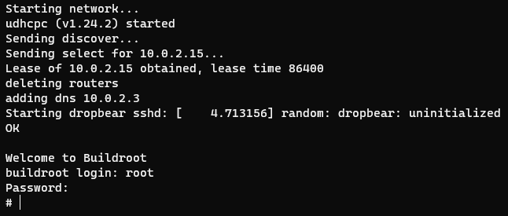
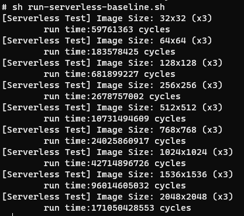
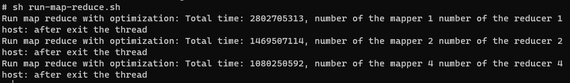

# Artifact for OSDI #15 #

## Introduction ##

We have **renamed** our project from *HEIMDALL* to *Penglai*! In this document, we just use *Penglai* to represent our enclave system, and we will unify the name in our final version.

Penglai is a software-hardware co-design enclave system. The main claim in our paper is that we make enclave more scalable. For convenience, we provide two simulators (QEMU, Gem5) to evaluate Penglai. 

**Note**: We have upgraded Penglai to OpenSBI and Linux-5.10.2. Opensbi is the most widely-used M mode routine and linux-v5 is the latest linux version, comparing with old Penglai (bbl+linux-v4). 

All the tests in AE are based on this new version. Note, our final version paper will also change the implementations and all evaluation results to the new version (but our claims does not change).

**Prerequisite:**

1. Git: Penglai uses git for version control
2. Docker: Penglai uses docker to create the build environment
3. Linux: All the testing scripts are developed for Linux (e.g., ubuntu-18.04 we used), which may be incompatible with mac or windows. 
## Getting started (artifact download) ##

We have open-sourced our project, see in the git repo:  

- Penglai-Enclave-TVM: https://github.com/Penglai-Enclave/Penglai-Opensbi-TVM.git

#### 1. Penglai-Enclave-TVM ####

To get the source code of penglai-enclave-tvm, you can use the following scripts:

```
git clone https://github.com/Penglai-Enclave/Penglai-Enclave-TVM.git
```

Enter the penglai-enclave-tvm directory, `cd Penglai-enclave-TVM`, and checkout to the artifact branch:

```
<dir_to_Penglai-Enclave-TVM >
git checkout artifact
git pull
```

Update all submodules：

```
git submodule update --init --recursive
```

#### 2. Penglai-Enclave-Gem5 ####

~~To get the source code of Penglai-Enclave-Gem5, you can use the following scripts:~~

~~git clone https://github.com/Penglai-Enclave/Penglai-Enclave-Gem5.git~~

~~Artifact code is in the main branch! Make sure the code is up-to-date.~~

~~Now you have everything needed to run Penglai's tests and reproduce the results.~~

Due to the IP consideration, the source code of Gem5-MMT cannot be publicly open-sourced now. 
If you are interested in reproducing the testing results in AE, please contact us at fengerhu1@sjtu.edu.cn.

## Run an example (Functionality) ##

##### Enter the <dir_to_Penglai-Enclave-TVM> #####

#### 1. Run *hello world* in the Penglai enclave ####

- Build the Penglai using the Docker image (need **several hours** **e.g., 2 hours in our machines**, for the first time)

  ```
  ./docker_cmd.sh build
  ```

- Run the Penglai in the qemu

  ```
  ./docker_cmd.sh qemu
  ```

- If the qemu boots successfully, you are required to log in the system (**username**: root, **pwd**: penglai) 

  Then, you can see the familiar prompt in the command line, and linux is booted successfully.

- Run the first enclave in the HEIMDALLR/Penglai:

  - Install the kernel module:

    ```
    sh insmod.sh
    ```

    

    After you install the kernel module successfully, you can see the "register_chrdev succeeded!" on the screen.

  - Run the hello-world as a demo:

    ```
     ./host/host hello-world/hello-world
    ```

    If the hello-world runs successfully, you can see the expected output: "hello world!" on the screen. Since then, you have successfully run the first enclave in the Penglai.

    

##### Enter the <dir_to_Penglai-Enclave-Gem5>

#### 2. Run *hello world* in Gem5 ####

- Build the gem5.opt (**need several hours, e.g., 3 hours in our machines**), you can find the output binary in the dir:build/RISCV/gem5.opt.

  ```
  ./docker_cmd.sh build
  ```

  If  gem5.opt is build successfully, you can see the "scons: done building targets" on the screen. 

- Run the first demo in the gem5: hello-world

  ```
   ./docker_cmd.sh hello
  ```

- Find the output file in m5out/simout-hello

  The output in the m5out/simout-hello must match with the following expected content.

  

## Main results of the paper and how to reproduce them(Reproducability) ##

##### **MMT result is evaluated on Gem5, enter the <dir_to_Penglai-Enclave-Gem5>**

#### 1. MMT performance ####

We claim that MMT has a better performance than SIT and VAULT.

As Gem5 is much slower than the real hardware (need **several days**, e.g., **2 days in our machines,** to finish all tests), we give the original log file in the <dir_to_mmt>/m5out/result. If you want to reproduce all results. You can type the following script.

- Build the gem5.opt image, you can find the output binary in the dir: build/ARCH/*

  ```
  ./docker_cmd.sh build
  ```

- Run the gem5 with the SPEC2k6 benchmarks (need **several days**)，the output is the execution cycles of each benchmark.

  ```
  ./docker_cmd.sh run 
  ```

  

- How to compare the results with the claim in the paper.

  After all tests are finished successfully, you can see the output results (cycles) for all benchmarks. However, in **Figure11: SPECCPU**, it only shows the execution time of the "None" (red number above the bar), you can estimate the execution cycles of the MMT according to the proportion of each bar.  

  Also, you can get the original evaluation results of MMT (used in paper) by typing the following script:

  ```
  ./docker_cmd.sh show
  ```

  

##### Following tests are evaluated on QEMU, enter the <dir_to_Penglai-Enclave-TVM>

#### 2. Run 1000+ enclave simultaneously ####

We claim that Penglai can run **1000** enclaves simultaneously on a single machine. 

**Prerequisite: Boot** the penglai in qemu, and **install** the penglai kernel module.

- To run the 1000 enclave in Penglai, you can use the following script:

  ```
  sh run-scalability.sh
  ```

  Each enclave may run about **2 minutes**, wait until all enclave is finished. The successful screen output is shown below:

  

- How to compare the results with the claim in the paper.

  We claim in the paper that Penglai can run 1000 enclaves simultaneously. In this test, we actually run 1000 enclaves without failure.

#### 3. IPC evaluatioin ####

We claim that a zero-copy IPC has better performance than a copy-based IPC. 

**Prerequisite: Boot** the penglai in qemu, and **install** the penglai kernel module.

- To run the IPC test cases in Penglai, you can use the following script:

  ```
  sh run-ipc.sh
  ```

  This benchmark will evaluate the performance of ownership-transfer-based IPC and copy-based IPC. Each IPC method will be evaluated with varied-size memory transferred or copied.

  

- How to compare the results with the claim in the paper

  We claim in the paper that ownership-transfer-based IPC can overwhelm copy-based IPC by 3.77-47.38 times speed-up for enclave-enclave communication, and 35.99-96.60 times speed-up for host-enclave communication.

  The picture above shows the result of ipc benchmark. We evaluate the cost(cycles) of IPC between host and enclave and cost of IPC between enclave and enclave. The [TEST] means ownership-transfer-based IPC and [TEST_BASELINE] means copy-based IPC. For each kind of IPC, we evaluate their performance with varied memory size(2MB and 64MB).

#### 4. Fast boot evaluation ####

We claim that creating an enclave from the shadow enclave is much **faster** than creating a normal enclave.

**Prerequisite: Boot** the penglai in qemu, and **install** the penglai kernel module.

- To create an enclave based on the shadow enclave, you can use the following script:

  ```
  sh run-fastboot.sh
  ```

  In this script, it will create four enclaves. Two use fast booting, and the other two use normal booting. For each booting method, there are two enclaves with different payload (2K, 16M), the payload of the enclave determines the enclave size. The configuration of each enclave shows below:

  |          |    Boot     | Payload |
  | -------- | :---------: | ------: |
  | Enclave1 |  Fast boot  |     2KB |
  | Enclave2 |  Fast boot  |    16MB |
  | Enclave3 | Normal boot |     2KB |
  | Enclave2 | Normal boot |    16MB |

- How to compare the results with the claim in the paper

  The enclaves that use the fast booting represent the "**Heimdallr-ShadowFork**" **In Figure 10b: Startup latency.** The enclaves that use the normal booting represents the "**Heimdallr-NoAttestation**" **In Figure 10b: Startup latency.** Take 16M enclave file size as an example (comparing boot time of enclave 2 and enclave4), we can calculate the speedup of fast booting is 198 (2115446304/10680797), which matches the result shown in Figure 10 (x-axis is 16M, line1 is "Heimdallr-ShadowFork", line2 is "Heimdallr-NoAttestation")

  

#### 5. RV8 benchmark ####

We claim that running RV8 tests in the enclave has a **similar** performance to running it in the native host.

**Prerequisite: Boot** the penglai in qemu, and **install** the penglai kernel module.

- To run RV8 benchmark, you can use the following script:

  ```
  sh run-rv8.sh
  ```

  This script will run six small CPU-intensive programs: aes, dhrystone, primes, qsort and sha512. This benchmark will compare the performance difference between native programs and programs executing in Penglai environment.

- How to compare the results with the claim in the paper

  We claim in the paper that the performance overheads in Penglai are < 4.3% in all the cases, and 1.7% on average. 

  

  The picture above shows the results of rv8 benchmark. `XXX` means application in Penglai environment and `XXX-baseline` means application in native Linux.

#### 6. Coremark benchmark ####

We claim that running Coremark tests in the enclave has a **similar** performance to running it in the native host.

**Prerequisite: Boot** the penglai in qemu, and **install** the penglai kernel module.

- To run Coremark benchmark, you can use the following script:

  ```
  sh run-coremark.sh
  ```

  This script will execute Coremark in native environment and in Penglai environment separately.

- How to compare the results with the claim in the paper

  We claim in the paper that the performance overhead in Penglai is 1.6% on average.

  

  The picture above shows the result of coremark test. The score(`iteration/sec`) of Penglai(`coremark`) is similar to score of native linux(`coremark-baseline`).

## Run the case study ##

#### 1. Case study: serverless ####

In the case study of serverless, we run the image process in the 4 enclaves, each enclave is responsible for partial functionality. In the first enclave, it will generate a picture with the given size, and pass it to the following enclave. 

- To run the image process in enclaves, you can type the following script:

  ```
  sh run-serverless.sh
  ```

  This script will create several enclaves to process the pictures with the different given size (32\*32 pixels~2048\*2048 pixels). The total run cycles are shown below.

  

  Also, you can run the image process in the native host, the total run cycles with different image sizes are shown below.

  ```
  sh run-serverless-baseline.sh
  ```

  

  Image process running in the enclave has the better performance than running in the host, which is also mentioned in the **section 6.5** in paper.

#### 2. Case study: MapReduce ####

In the case study of MapReduce, we run several mappers and reducers in the enclaves, and optimize the performance with the techniques like fast booting and zero-copy ipc. 

- To run the MapReduce in the enclaves, you can type the following script.

  ```
  sh run-map-reduce.sh
  ```

  This script will run MapReduce with several different configurations:

  - "1-mapper, 1-reducer without optimization"
  - "1-mapper, 1-reducer with optimization"
  - "2-mapper, 2-reducer with optimization"
  - "4-mapper, 4-reducer with optimization"

  The total run cycles are printed on the screen, and running MapReduce using optimized enclaves has better performance than using normal enclaves. 

  

  As kvm is disabled in our qemu platform, qemu can not directly run multi-vcpus on the multi-real cores. Also, qemu has some schedule issues for concurrent programs when enabling multi-vcpus, so we only set `smp=1` in our qemu configurations. However, We also test MapReduce (multi-mappers and multi-reducers) on the FPGA board. It can gain performance improvement due to the capacity of multi-cores on real hardware.

- The MapReduce result on fpga board.

  We have run MapReduce on Xilinx VC707 FPGA board with SiFive Freedom U500. The results are shown below:

  
  If you want to run Penglai on FPGA board, you can download our bitstream of Penglai Rocket core (url:https://github.com/Penglai-Enclave/Penglai-Enclave-RocketCore), which is based on Freedom U500. Our testing scripts are runnable on both QEMU and FPGA platforms.
